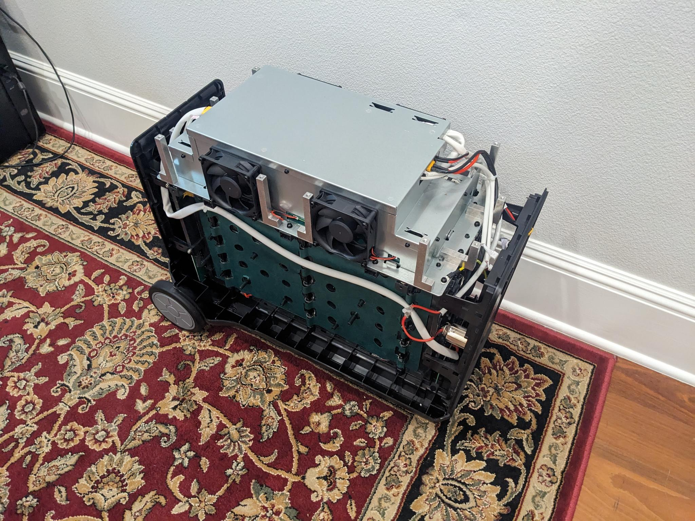
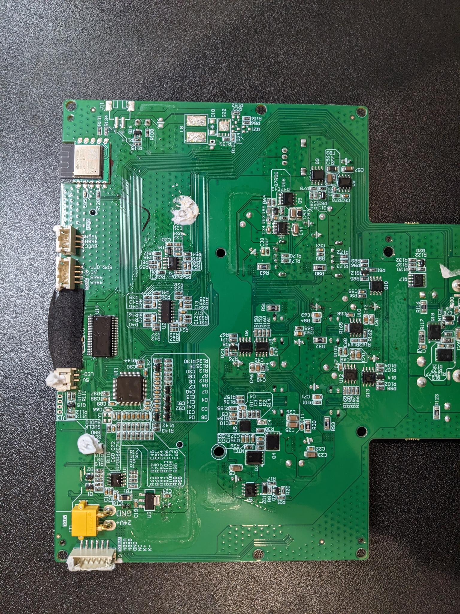
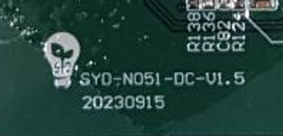
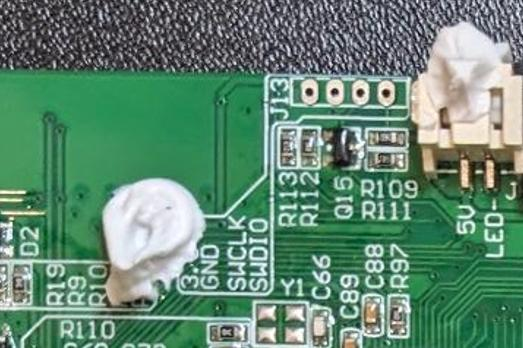
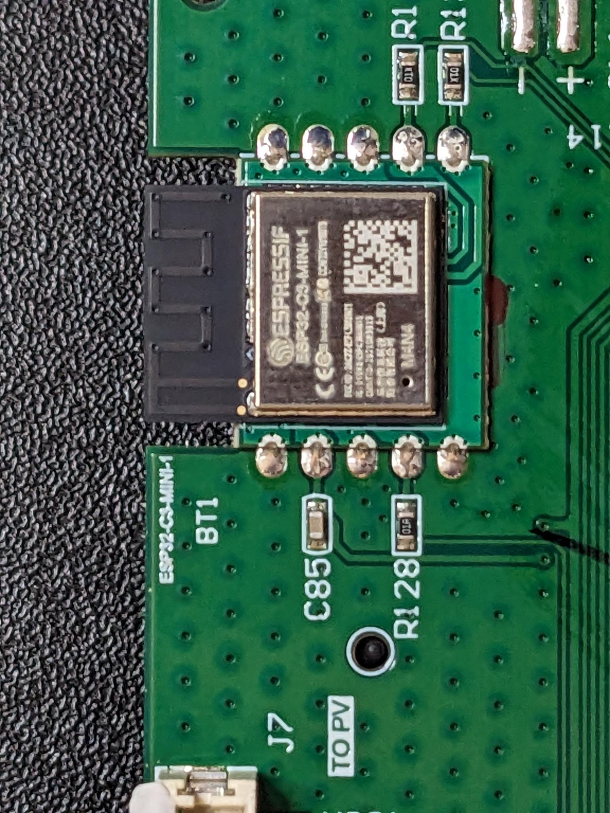
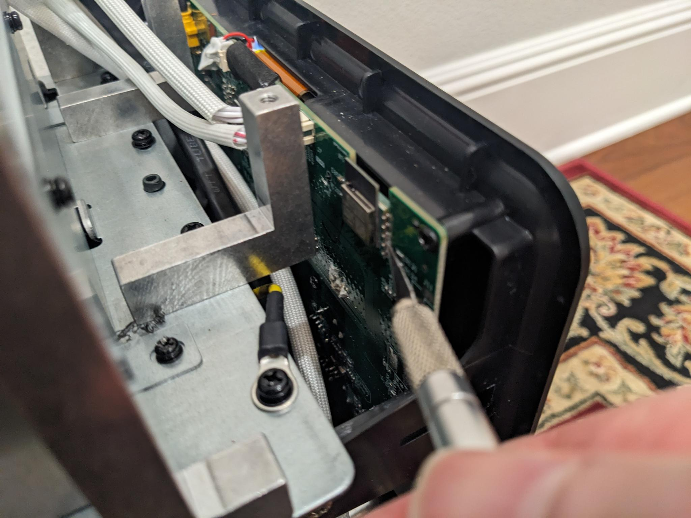
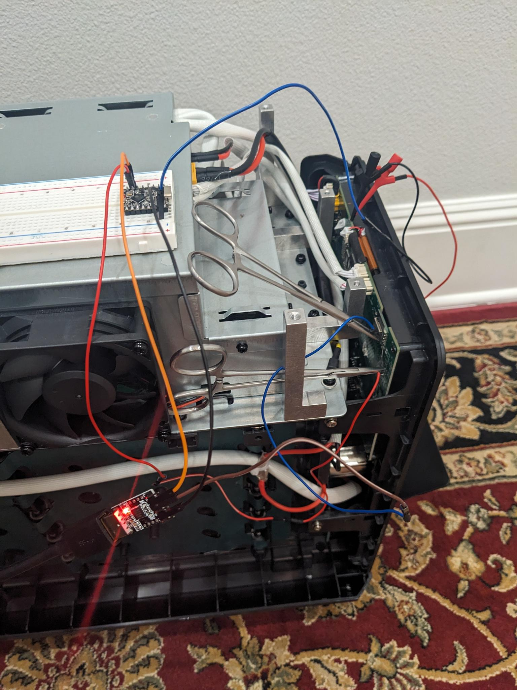

# Power Station Internals

I have a AFERIY P310 that is stuck in a reboot loop, likely because a bad setting was sent to the device using Bluetooth. This is a really sad thing about these devices, anyone with a cellphone in proximity of this battery could, without any authentication, send a bad command to the battery to cause it to go into a reboot loop basically bricking it. On this page, we will be taking a look at the internals of the device and how it works.

## Opening the Battery

Obviously, this is a battery with a lot of power and a huge inverter so, be super careful when doing this. The first step to to remove the top of the device. There are a set of rubber plugs and two rubber strips that are easy to remove. After that, remove all of the screws and take off the top of the device. I then you can removed the sides but this may not be needed because depending on what you do, you may have access to the pins you want to monitor. The sides are a bit more difficult to remove as there are healed at two snap-in locations at the bottom. Once you know these locations it's easier to un-snap and pull up. There is the battery with the top and sides removed.



I kept a small bag with all of the screws. Luckly it's very clear what goes where. If you take your voltmeter out and test around, you will see there are two bars that are exposed with 48v on them. So again, be super careful if you do this. In my case, I then took the front motherboard out.

## Looking at the Motherboard

There is while glue used to make sure nothing gets disconnected during transport which is easy to remove. You have to disconnect 3 white connectors and 1 power connection from the main board. All the connectors are a bit different so, it's not possible to put them back incorrectly which is nice. Here is a picture of the main board:



I have [other pictures of the motherboard here](https://github.com/Ylianst/ESP-FBot/tree/main/internals/boardimages). At the bottom of the board, I see the following indication:



It says "SYD-N051-DC-V1.5" on the first line and "20230915" on the second line. You can immidiately see that this is a board from [Shenzhen SYD Network Technology Co. Ltd.](https://sydpower.com/) and on their web site there is a range of power stations that you can get and brand anyway you like. This is the original source of the battery with AFERIY and others re-branding it.

It looks like the board is run by an ARM Cortex processor, but you can see that they took extra care to black out all of the chips so to make them more difficult to identify. On the top left is the typical ARM debug port with 4 connectors (3.3v, GND, SWCLK, SWDIO on the J13 connector).



Here is a IA guess at where the two main chips on the board are:

- U11, GD32F303 series microcontroller (likely a GD32F303RBT6).
- U14, GD32F130 series microcontroller (likely a GD32F130G6 in a 28-pin SOP package).

This is typically a Serial Wire Debug (SWD) for ARM Cortex processors. It's typically used to flash and debug the ARM processor. On the top right of the motherboard is the ESP32 chip that does WIFI and Bluetooth. The 2.4Ghz antenna is the small wiggle in the black area.



This is a `ESP32-C3-MINI-1 M4N4`, you can find the [documentation for this chip here](https://documentation.espressif.com/esp32-c3-mini-1_datasheet_en.pdf). Going with a voltmeter and just testing the pins along with looking at the location of the pins on the ESP32-C3-MINI-1, I think this are the pin connections for the ESP32:

```
    Ground *   * Ground
      3.3v *   * Ground
    Ground *   * Ground
EN (Reset) *   * 21 UART TX   <-- ESP32 to ARM
    Ground *   * 20 UART RX   <-- ARM to ESP32
```

While there are 10 pins connects to the ESP32, there are only really 5: Ground, 3.3v, Enable, TX and RX.

## ARM to ESP32 Communication

I put the motherboard back into the battery and used a [cheap 10$ USB logic analyser](https://www.amazon.com/dp/B0CHZ13R6D) to spy on the communication between the ARM and ESP32 using software called [PulseView](https://sigrok.org/wiki/PulseView). With one hand, I pushed the channel 4 and 5 of the logic analyser wires to the UART RX and TX, started the PluseView recording and powered on the battery. It's crazy that it worked, but it did. You can then easily decode the messages between both chips.


You can find my [PulseView capture files from the boot looping battery here](https://github.com/Ylianst/ESP-FBot/tree/main/internals/pulseview). "Capture001" was my first succesful capture of both TX and RX pins at a sampling rate that is way too high since I did not know what I would except. D4 is from the ARM to the ESP32, and D5 are the responses from the ESP32. "Capture003" has both traffic directions and the ESP32 enable (EN) pin. This is very useful since you can see exacly the sequence of commands and the reboot of the ESP32 due to the lowering of the ESP32 enable line.

I also have a set of [PulseView capture files from the good battery here](https://github.com/Ylianst/ESP-FBot/tree/main/internals/pulseview-good). You can see the full startup sequence in "Capture001", then me pressing the local button to turn on/off the AC/DC/USB power in "Capture002" and finally me sending commands over Bluetooth in "Capture003". This is interesting so you can see how the power station works in a normal situation. Next, we look at my analysis of the serial protocol.

## AT Serial Protocol

It turns out the ARM Cortex chip talks to the ESP32 using standard 115200,N,8,1 serial settings and using standard "AT" commands. It seems like the ESP32 is loaded with a standard "proxy" firmware from Espressif and documentation of the AT commands is here: [Espressif AT Command Set](https://docs.espressif.com/projects/esp-at/en/latest/esp32/AT_Command_Set/Basic_AT_Commands.html) In PulseView, you can use the UART decoder to see all of the messages.

So, the ARM chip instructs the ESP32 to enable it's Bluetooth, WIFI and more over a standard serial port. All the AT commands are in ASCII format and easy to read and understand. Here is the initial conversation between the ARM chip and the ESP32, this gets the Bluetooth ready for connections. I added "ARM:" for commands sent by the ARM chip to the ESP32 and "ESP:" for data coming from the ESP32.

```
ARM: AT+RST\r\n                          <-- ARM tells the ESP32 to restart
ESP: \r\nready\r\n                       <-- ESP32 is ready
ARM: AT\r\n                              <-- Simple ping/pong
ESP: AT\r\n
ESP: \r\nOK\r\n
ARM: AT+BLEINIT=2\r\n                    <-- Initializes the BLE stack. The value 2 sets the ESP32 as a Server.
ESP: AT+BLEINIT=2\r\n
ESP: \r\nOK\r\n
ARM: AT+SYSMSG=7\r\n                     <-- Value 7 tells the ESP32 to notify the ARM chip about BLE connection and disconnection events.
ESP: AT+SYSMSG=7\r\n
ESP: \r\nOK\r\n
ARM: AT+CWRECONNCFG=10,0\r\n             <-- Wi-Fi command, try reconnecting to Wi-Fi 10 times if it loses a connection.
ESP: AT+CWRECONNCFG=10,0\r\n
ESP: \r\nOK\r\n
ARM: AT+BLEGATTSSRVCRE\r\n               <-- GATT Server Create. This tells the ESP32 to build the database of services in its memory.
ESP: AT+BLEGATTSSRVCRE\r\n
ESP: \r\nOK\r\n
ARM: AT+BLEGATTSSRVSTART\r\n             <-- GATT Server Start. This officially launches the services so they are active and ready for a client to read/write.
ESP: AT+BLEGATTSSRVSTART\r\n
ESP: \r\nOK\r\n
ARM: AT+BLEADDR?\r\n                     <-- ARM requests the Bluetooth MAC address
ESP: AT+BLEADDR?\r\n
ESP: +BLEADDR:"a8:46:74:41:4c:42"\r\nOK\r\n
ARM: AT+BLEADVDATAEX="POWER-7E83","7e83","99A84674414C4200",1\r\n    <-- Broadcast a Bluetooh advertising packets
ESP: AT+BLEADVDATAEX="POWER-7E83","7e83","99A84674414C4200",1\r\n
ESP: \r\nOK\r\n
ARM: AT+BLEADVSTART\r\n
ESP: AT+BLEaDVSTaRT\r\n
```

You notice that except for the initial reset command, the ESP32 will echo back the command it received from the ARM chip and then respond to it. You can see a bunch of "BLE" (Bluetooth) messages to get Bluetooth started. At this point, the battery is ready to receive Bluetooth messages. Let's now see what connecting a Bluetooth clients does. I am going to use a HomeAssistant ESP-FBot ESP32 as client to connect to the battery:

```
ESP: +BLECONN:0,"f0:24:f9:bb:d3:ca"\r\n          <-- Bluetooth client connection

ARM: AT+BLEGATTSNTFY=0,1,6,168\r\n               <-- Client get initial block of data
ESP: AT+BLEGATTSNTFY=0,1,6,168\r\n>
ARM: (168 bytes of binary data)
ESP: \r\nOK\r\n

ESP: +BLECFGMTU:0,517\r\n                        <-- Client configures MTU to 517 bytes

(This is a typical user command, like turn the battery's light on, off, etc)
ESP: +WRITE:0,1,5,,8,(8 bytes of binary data, last 2 are CRC)\r\n
ARM: AT+BLEGATTSNTFY=0,1,6,168\r\n
ESP: AT+BLEGATTSNTFY=0,1,6,168\r\n>
ARM: (168 bytes of binary data, last 2 are CRC)
ESP: \r\nOK\r\n

ESP: +BLEDISCONN:0,"f0:24:f9:bb:d3:ca"\r\n       <-- Bluetooth client disconnects
```

So, we have our Bluetooth client connecting, setting the MTU which is the "Maximum Transfer Unit" which is the largest packet it will accept. Then, you get a block of 168 bytes of data and the client can write data and get an updated state of 168 bytes. The next step is to look into the binary writes and notifications. Here is a typical "WRITE" and the response.

```
ESP: +WRITE:0,1,5,,8,[11 03 00 00 00 50 66 47]\r\n   <-- Request settings registers. Last 2 bytes are the CRC

ARM: AT+BLEGATTSNTFY=0,1,6,168\r\n
ESP: AT+BLEGATTSNTFY=0,1,6,168\r\n>
ARM: (Sends 168 bytes of data, last 2 bytes are the CRC)
11 03 00 00 00 50 00 00 00 00 00 FF FF FF 00 00 
00 01 00 00 00 00 00 00 00 00 00 00 06 00 00 09 
00 02 05 DC 00 00 07 D0 00 14 00 73 06 40 00 14 
03 00 00 E9 00 00 00 00 00 00 00 00 00 00 00 00 
00 00 01 19 01 0A 02 03 00 00 00 00 00 00 00 00 
00 03 00 00 00 00 02 50 0F 04 00 00 00 00 00 00 
00 00 00 00 00 26 00 18 00 1B 00 24 00 00 00 00 
00 00 00 00 00 00 00 00 00 00 00 00 00 03 01 E0 
01 E0 01 2C 00 00 00 00 00 00 00 00 03 E8 00 05 
00 00 00 00 00 00 00 00 00 00 00 00 00 00 00 00 
00 00 00 00 00 00 CD 09
ESP: \r\nOK\r\n
```

Above is a typical set of register values for the settings values. Below are typical values for the input registers:

```
ESP: +WRITE:0,1,5,,8,[11 04 00 00 00 50 A6 F2]\r\n   <-- Request input registers. Last 2 bytes are the CRC

ARM: AT+BLEGATTSNTFY=0,1,6,168\r\n
ESP: AT+BLEGATTSNTFY=0,1,6,168\r\n>
ARM: (Sends 168 bytes of data, last 2 bytes are the CRC)
11 04 00 00 00 50 00 00 00 00 00 02 00 00 00 00 
00 00 00 00 00 00 00 00 00 00 00 00 00 00 00 00 
00 00 00 00 00 00 00 00 00 00 00 00 02 58 00 00 
00 00 00 00 00 00 00 00 00 00 00 00 00 00 00 00 
00 00 00 00 00 00 00 00 00 00 00 00 00 00 00 00 
00 00 00 00 00 00 00 00 00 00 00 00 00 00 00 00 
00 00 00 00 30 00 40 00 00 00 00 00 00 00 00 00 
00 00 03 14 00 00 03 A5 00 00 00 00 AB F1 00 00 
00 00 00 FF FF FF 00 00 00 00 00 00 00 00 00 00 
00 00 00 00 00 00 00 00 00 00 00 00 00 00 00 00 
00 00 00 00 00 00 98 33
ESP: \r\nOK\r\n
```

The "WRITE" command is generally used in 3 ways:

- Read the input registers. The command is `+WRITE:0,1,5,,8,[11 04 00 00 00 50 A6 F2]`. This will read the 80 read-only registers with all of the various state of the power station.
- Read the settings registers. The command is `+WRITE:0,1,5,,8,[11 03 00 00 00 50 66 47]`. This will read the 80 read/write settings or holding registers.
- Write to a settings register. For example `+WRITE:0,1,5,,8,[11 06 00 39 00 01 97 9A]`. This command will write into register 57 (0x39) the value 1.

You can see that the write command is the same except for the binary part that starts with 0x11 then the command (3, 4 or 6), data and the last 2 bytes are the CRC. You can calculate the CRC using the [this CRC online calculator](https://www.codertools.net/tools/crc.php), you need to set the input format to "HEX" and CRC to "CRC-16/MODBUS". Then, paste the entire data packet except the last 2 bytes and you should get the last 2 bytes calculated correctly.

```
+WRITE:0,1,5,,8,[11 06 00 39 00 01 97 9A]\r\n   <-- Write value 1 into settings register 57
AT+BLEGATTSNTFY=0,1,6,8\r\n
AT+BLEGATTSNTFY=0,1,6,8\r\n>
ARM: (Sends 8 bytes of data, last 2 bytes are the CRC)
11 06 00 39 00 01 97 9A
ESP: \r\nOK\r\n
```

Now that we saw how the WRITE command is used, we can looks at the details of the binary protocol. After this point, we will omit the "AT" command and just assume binary is going and from the ARM chip.

## Binary Protocol

The binary protocol used between the Bluetooth client and the power station is based on [Modbus RTU](https://en.wikipedia.org/wiki/Modbus). All commands use device address `0x11` and all multi-byte values are big-endian. Every command and response ends with a 2-byte CRC-16/Modbus checksum.

### BLE Service and Characteristics

The Bluetooth GATT service and characteristics used are:

| UUID | Purpose |
|------|---------|
| `0000a002-0000-1000-8000-00805f9b34fb` | Service UUID |
| `0000c304-0000-1000-8000-00805f9b34fb` | Write Characteristic (client → device) |
| `0000c305-0000-1000-8000-00805f9b34fb` | Notify Characteristic (device → client) |

The client writes commands to the Write Characteristic and receives responses as notifications on the Notify Characteristic.

### Command Format

All standard commands are 8 bytes:

```
[Address] [Function] [Byte 2] [Byte 3] [Byte 4] [Byte 5] [CRC High] [CRC Low]
```

- **Address** is always `0x11`.
- **Function** is the Modbus function code.
- **CRC** is CRC-16/Modbus over the first 6 bytes.

### Response Format (168 bytes)

All read responses are 168 bytes. The first 6 bytes echo the request header, followed by 80 registers (2 bytes each, big-endian), and a 2-byte CRC:

```
Bytes  0-5:    Header (echoes the request: address, function, start_reg_h, start_reg_l, num_regs_h, num_regs_l)
Bytes  6-165:  Register data (80 registers × 2 bytes each, big-endian)
Bytes  166-167: CRC-16/Modbus
```

To read register N from the response, read the 2-byte big-endian value at byte offset `6 + (N × 2)`.

### Read Commands

There are two read commands, both requesting 80 registers (0x50) starting from register 0:

#### Read Status (Input Registers) — Function Code `0x04`

Requests the live status of the power station (battery level, power in/out, active outputs, etc).

```
Write:    11 04 00 00 00 50 [CRC] [CRC]
Response: 168 bytes (function code 0x04 in byte 1)
```

#### Read Settings (Holding Registers) — Function Code `0x03`

Requests the device settings (thresholds, silent mode, key sound, light mode, etc).

```
Write:    11 03 00 00 00 50 [CRC] [CRC]
Response: 168 bytes (function code 0x03 in byte 1)
```

### Write Command — Function Code `0x06`

Writes a single 16-bit value to a register. Used to control outputs and change settings.

```
Write:    11 06 [REG_H] [REG_L] [VALUE_H] [VALUE_L] [CRC] [CRC]
```

For example, to turn the USB output on (register 24, value 1):

```
11 06 00 18 00 01 [CRC] [CRC]
```

After a write, the device responds with an updated 168-byte status notification.

### WiFi Configuration Command — Function Code `0x07`

This is a custom (non-standard Modbus) command used to set WiFi credentials on the device. It has a variable length:

```
[0x11] [0x07] [SSID_LEN] [PASS_LEN] [SSID bytes...] [PASS bytes...] [CRC_H] [CRC_L]
```

- **Byte 0**: Address (`0x11`)
- **Byte 1**: Function code (`0x07`)
- **Byte 2**: SSID length (1–255)
- **Byte 3**: Password length (1–255)
- **Bytes 4 to 4+SSID_LEN-1**: SSID string (ASCII, no null terminator)
- **Next PASS_LEN bytes**: Password string (ASCII, no null terminator)
- **Last 2 bytes**: CRC-16/Modbus over everything before the CRC

### Status Registers (Function Code `0x04` Response)

These are the registers parsed from the 168-byte status notification. Register data starts at byte offset 6 in the response.

| Register | Description | Unit / Scaling | Notes |
|----------|-------------|----------------|-------|
| 2 | Charge Level | Raw 1–5 | 1=300W, 2=500W, 3=700W, 4=900W, 5=1100W |
| 3 | AC Input Power | Watts (direct) | |
| 4 | DC Input Power | Watts (direct) | |
| 6 | Input Power | Watts (direct) | Total input |
| 18 | AC Output Voltage | × 0.1 = Volts | e.g. 1200 → 120.0V |
| 19 | AC Output Frequency | × 0.1 = Hz | e.g. 600 → 60.0 Hz |
| 20 | Total Power | Watts (direct) | |
| 21 | System Power | Watts (direct) | |
| 22 | AC Input Frequency | × 0.01 = Hz | e.g. 6000 → 60.00 Hz |
| 30 | USB-A1 Output Power | × 0.1 = Watts | |
| 31 | USB-A2 Output Power | × 0.1 = Watts | |
| 34 | USB-C1 Output Power | × 0.1 = Watts | |
| 35 | USB-C2 Output Power | × 0.1 = Watts | |
| 36 | USB-C3 Output Power | × 0.1 = Watts | |
| 37 | USB-C4 Output Power | × 0.1 = Watts | |
| 39 | Output Power | Watts (direct) | Total output |
| 41 | State Flags | Bitmask | See bitmask table below |
| 53 | Battery S1 Percent | ÷ 10 − 1 = % | 0 = disconnected (extra battery) |
| 55 | Battery S2 Percent | ÷ 10 − 1 = % | 0 = disconnected (extra battery) |
| 56 | Battery Percent | ÷ 10 = % | Main battery |
| 58 | Time to Full | Minutes (direct) | 0 if not charging |
| 59 | Remaining Time | Minutes (direct) | 0 if not discharging |

#### State Flags (Register 41) Bitmask

| Bit | Decimal | Description |
|-----|---------|-------------|
| 9 | 512 | USB output active |
| 10 | 1024 | DC output active |
| 11 | 2048 | AC output active |
| 12 | 4096 | Light active |

For example, a state flag value of `0x0E00` (3584 decimal = 512 + 1024 + 2048) means USB, DC, and AC outputs are all on.

### Settings Registers (Function Code `0x03` Response)

These are the registers parsed from the 168-byte settings notification.

| Register | Description | Values / Scaling |
|----------|-------------|-----------------|
| 13 | AC Charge Limit | 1–5 (matches charge level options: 1=300W, 2=500W, 3=700W, 4=900W, 5=1100W) |
| 27 | Light Mode | 0=Off, 1=On, 2=SOS, 3=Flashing |
| 56 | Key Sound | 0=off, 1=on |
| 57 | AC Silent Mode | 0=off, 1=on |
| 66 | Discharge Threshold | ÷ 10 = % (e.g. 100 → 10%) |
| 67 | Charge Threshold | ÷ 10 = % (e.g. 1000 → 100%) |

### Writable Registers (Function Code `0x06`)

These are the registers that can be written to control the device.

| Register | Description | Valid Values |
|----------|-------------|-------------|
| 13 | AC Charge Limit | 1–5 |
| 24 | USB Output | 0=off, 1=on |
| 25 | DC Output | 0=off, 1=on |
| 26 | AC Output | 0=off, 1=on |
| 27 | Light Control | 0=Off, 1=On, 2=SOS, 3=Flashing |
| 56 | Key Sound | 0=off, 1=on |
| 57 | AC Silent Mode | 0=off, 1=on |
| 66 | Discharge Threshold | 0–500 (in permille, divide by 10 for percent) |
| 67 | Charge Threshold | 100–1000 (in permille, divide by 10 for percent) |

### CRC-16/Modbus Checksum

All commands and responses use CRC-16/Modbus. The algorithm uses an initial value of `0xFFFF` and the polynomial `0xA001`:

```
crc = 0xFFFF
for each byte in data:
    crc = crc XOR byte
    repeat 8 times:
        if (crc AND 1):
            crc = (crc >> 1) XOR 0xA001
        else:
            crc = crc >> 1
```

The resulting 2-byte CRC is appended big-endian (high byte first) to the command. You can verify checksums using the [CRC online calculator](https://www.codertools.net/tools/crc.php) by setting the input format to "HEX" and CRC to "CRC-16/MODBUS".

### Working Example

Here is a complete example of a status read from the earlier hex capture:

**Client sends** (8 bytes — "read 80 input registers starting at register 0"):

```
11 04 00 00 00 50 A6 F2
│  │  │     │     └──── CRC-16/Modbus
│  │  │     └────────── Number of registers: 0x0050 = 80
│  │  └──────────────── Starting register: 0x0000
│  └─────────────────── Function code: 0x04 (Read Input Registers)
└────────────────────── Device address: 0x11
```

**Device responds** (168 bytes — header echoes request, then 80 registers, then CRC):

```
Byte offset:  0  1  2  3  4  5 |  6  7  8  9 10 11 ...
              11 04 00 00 00 50 | R0_H R0_L R1_H R1_L R2_H R2_L ...
              ─── header ───── | ──────── register data ────────
```

Looking at the sample data from the capture, some values can be extracted:

- Register 41 at offset `6 + (41 × 2) = 88`: state flags — check bits for USB/DC/AC/Light state
- Register 56 at offset `6 + (56 × 2) = 118`: battery percent — divide by 10 for %
- Register 59 at offset `6 + (59 × 2) = 124`: remaining time in minutes

## Performing a Serial Capture

If you ever want to look at the traffic between the ARM and ESP32 chips, you can get a "CP2102 USB to TTL Serial Adapter" online and connect the RX wire of the adapter to the pins RX or TX pin of the ESP32. You can then run a terminal like Putty at 115400 bauds and see the traffic.


You can only see one direction at a time (to the ESP32 or from the ESP32) but you will see the AT commands in text form on putty as they arrive. I personnaly manually hold the pins to the ESP32 pads since they are prety large and so, not difficult to do. Using a multi channel logic analyser is better since you get all of the timing data and data in both directions, but a simple serial adapter does work. You will not be able to transmit using your adapter, only receive.

## Fixing a PowerStation in a Boot Loop

If your PowerStation reboots every 7 to 8 seconds making it unusable, it's going to be difficult to fix because Bluetooth never gets up and running before the next reboot and so, you can't send any commands to the battery to attempt to fix it. A quick way to get the PowerStation back up and running again is to find the ESP32 chip that looks like this:


And cut the "UART TX" pin (red line on the picture), making it impossible for the ESP32 to send commands back to the ARM processor. The pin to cut is on the right side of the ESP32, the 4th from the top.

```
    Ground *   * Ground
      3.3v *   * Ground
    Ground *   * Ground
EN (Reset) *   * 21 UART TX   <-- ESP32 to ARM (CUT THIS ONE)
    Ground *   * 20 UART RX   <-- ARM to ESP32
```

Do turn off the power station before starting and  note that voltage will never be zero all over the unit because it's a battery. What I did is to use an exacto knife and gently scrape the solder between the ESP32 and the pad away using many passes. You can see it in this picture (cut at the red line):



You could also remove the resistance on that same wire or cut the "EN" or "3.3v" and it would also make the PowerStation work again by disabling the ESP32. However, I recommnend this approche since by cutting the TX pin, it's possible to later fix the Bluetooth/WIFI by taking over the TX pin pad and once fixed, re-solder the TX pin.

Having access to the disconnected TX pin pad on the board gives you the option to wire a different ESP32 computer and work on fixing the problem. So, this is why I recommend it.

Now, the that ESP32 TX pin is disconnected, I used a USB-to-Serial device to connect the RX and TX pins. Once setup I had AI try to emulate the ESP32 and send commands to recover the battery, however after many tries, it's not been succesful. Here my serial connection setup.



The goal was to try to send commands to get the settings registers and fix the incorrect ones, however all attempts to send commands to get or set the settings registers failed and if I respond like the real ESP32, I cause the boot loop. So, I decided to re-assemble the battery with the ESP32 TX pin disconnect and use it without WIFI/Bluetooth. It looks like it works well otherwise.

One thing I did not try is that now that I have the battery working without a boot loop, maybe doing a reset by holding Light/USB/DC buttons at the same time and then try again, but anyway. The battery works again (mostly).